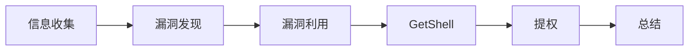

# 🎯 靶场学习笔记

> 记录每次打靶的完整过程：**信息收集 → 漏洞利用 → GetShell → 提权 → 总结**
> 每个靶场一篇独立笔记，格式参考 [[_模板]]

---

## 📌 靶场索引

| 日期 | 靶场 | 难度 | 核心考点 | 状态 | 笔记 |
|------|------|------|---------|------|------|
| 2026-08-17 | Sunrise-Harbor 商城靶场 | ⭐ 入门 | SQL注入 / 文件上传 / 定时任务提权 | ✅ 通关 | [[2026-08-17-Sunrise-Harbor商城靶场]] |

---

## 📋 打靶标准流程



### 1. 信息收集
```bash
# 主机发现（找靶机 IP）
ipconfig / ip a                    # 确认自己的网段
nmap -sn 192.168.x.0/24            # 扫网段，注意分辨路由器(MAC厂商)

# 端口扫描
nmap -p- <靶机IP>                  # 全端口
nmap -sV -sC -p- <靶机IP>          # 版本 + 默认脚本
```

### 2. 漏洞发现
- 漏洞扫描：`wapiti -u http://<IP>` / nuclei / nikto
- 目录枚举：`ffuf` / dirsearch / gobuster
- 手工探测：SQL注入、文件上传、命令注入

### 3. 漏洞利用 / GetShell
- SQL注入 → 万能钥匙 / sqlmap 脱库
- 文件上传 → 一句话木马 → getshell
- 反弹shell → 建立交互终端

### 4. 提权
- 定时任务（crontab）
- SUID 提权
- sudo 配置错误
- 内核漏洞

### 5. 总结
- 考点回顾、踩坑记录、防御思路

---

## 🗂️ 目录结构

```
靶场学习笔记/
├── README.md                  # 本索引页
├── _模板.md                   # 通关笔记模板（打新靶场复制它）
└── 2026-XX-XX-靶场名.md       # 每个靶场一篇
```
